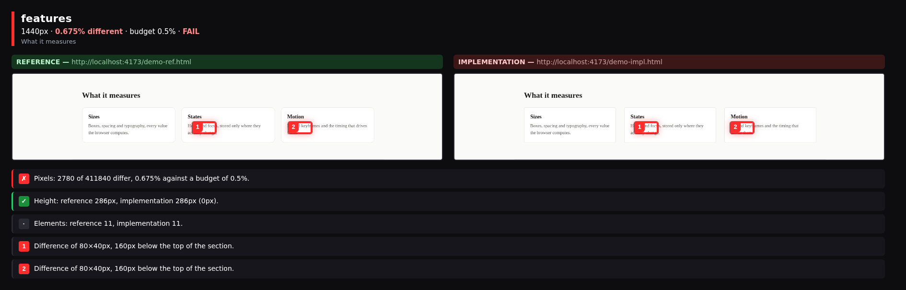

<div align="center">

<picture>
  <source media="(prefers-color-scheme: dark)" srcset="assets/logo-dark.svg">
  
</picture>

**Measure a UI against the design it is supposed to match, before any baseline exists.**

[](https://github.com/jamalkamaladdin/pixelpact/actions/workflows/ci.yml)
[](https://www.npmjs.com/package/pixelpact)
[](https://nodejs.org)
[](./LICENSE)

</div>

Someone says the page is done. You look at it and it does not match. Nothing in the room is
measured, so the conversation becomes opinion: that gap looks too big, no it does not.

pixelpact reads the reference, a live page or a Figma frame, and writes down what it actually
renders: sizes, colors, spacing, typography, hover and focus states, animation keyframes,
design tokens. That file is the **contract**. Point pixelpact at your implementation and it
answers with numbers, one line per property that drifted.

```bash
npx pixelpact extract https://reference.example.com -o contract.json
npx pixelpact check contract.json http://localhost:3000
```

## Works with

<div align="center">

| **Playwright** | **MCP clients** | **GitHub Actions** | **Figma** | **Any framework** |
| :------------: | :-------------: | :----------------: | :-------: | :---------------: |
| the engine it drives | agents measure their own work | one comment on the pull request | frames as the reference | it reads the DOM, not your stack |

*If a browser can render it, pixelpact can measure it.*

</div>

## Why this is not visual regression testing

Percy, Chromatic, Applitools, BackstopJS and Pixeleye all compare your page against a baseline
that you approved earlier. That model works once the page already looks right and you want to
keep it that way. While you are still building toward a design, there is no baseline to
compare with, and the first run of a regression tool simply records whatever you produced.

|                              | Visual regression tools            | pixelpact                          |
| ---------------------------- | ---------------------------------- | ---------------------------------- |
| Compares against             | a snapshot you approved earlier    | the reference design itself        |
| Useful when                  | the UI is already correct          | the UI is being built              |
| First run on a new page      | records, cannot judge              | measures against the reference     |
| Answer you get               | an image diff to inspect by eye    | a value per property, with a delta |
| Fits an autonomous agent     | needs a human to approve the diff  | the numbers close the loop         |

The two models are complementary. Use a regression tool to keep a finished page finished, and
pixelpact to get it finished in the first place.

## Problems pixelpact solves

| Without pixelpact | With pixelpact |
| ----------------- | -------------- |
| ❌ Someone says the section is finished, you disagree, and neither of you has a number. The louder opinion wins. | ✅ Every value in the reference is asserted against your page. What failed is listed with expected, actual and the difference. |
| ❌ A regression tool has nothing to compare a brand new page against, so its first run records whatever you happened to build. | ✅ The reference is the baseline from the first minute. Nothing has to be approved before the tool is useful. |
| ❌ A coding agent writes CSS, declares it done, and a person has to open the page to find out that it is not. | ✅ The agent calls the MCP server, reads the deviations, fixes them and checks again. No person in the middle. |
| ❌ Hover, focus and animation values are almost never reviewed, because checking them by hand is slow and boring. | ✅ They are part of the contract, so they are measured on every run like any other value. |
| ❌ An image diff tells you that something changed and leaves you to hunt for what. | ✅ Deviations name the element, the property, the expected value and the measured one. |
| ❌ The design lives in a file nobody opens during code review. | ✅ The contract is committed JSON, so a pull request shows exactly which values moved. |

## Install

```bash
pnpm add -D pixelpact playwright
pnpm exec playwright install chromium
```

`playwright` is a peer dependency, so the browser download stays under your control and a
project that already has Playwright installs nothing extra. Node 22.12 or newer is required.

## Quickstart

**1. Extract the contract from the reference.**

```bash
npx pixelpact extract https://reference.example.com \
  --selector "main" \
  --viewport desktop,mobile \
  --screenshots .pixelpact/shots \
  -o contract.json
```

**2. Measure your implementation.**

```bash
npx pixelpact check contract.json http://localhost:3000 --viewport desktop
```

**3. Fix what it reports, then run it again.** The command exits `0` when everything is inside
tolerance and `1` when it is not, so it drops straight into a script or a CI job.

### From Figma instead of a live page

`extract` recognises a Figma url and reads the frame through the REST API. No browser is
launched for this step.

```bash
export FIGMA_TOKEN=figd_...
npx pixelpact extract "https://www.figma.com/design/KEY/Name?node-id=12-345" -o contract.json
npx pixelpact check contract.json http://localhost:3000
```

A Figma layer has no CSS selector, so a Figma contract binds to your markup through
`data-contract` attributes. Name the element after the layer and matching stops depending on
how the design happened to nest its frames:

```html
<a class="btn btn-primary" data-contract="Hero/CTA">Get started</a>
```

Anything with no match is reported as missing rather than guessed from tag names.

## What a contract looks like

A contract is plain JSON, readable and diffable, with no proprietary format and no service
behind it.

```jsonc
{
  "version": 1,
  "source": { "type": "url", "value": "https://reference.example.com" },
  "root": "main",
  "extractedAt": "2026-09-06T01:20:44.812Z",
  "viewports": [{ "name": "desktop", "width": 1440, "height": 900 }],
  "tokens": { "--brand-600": "rgb(11, 114, 133)" },
  "keyframes": { "fade-up": [{ "offset": "0%", "css": "opacity: 0" }] },
  "byViewport": {
    "desktop": {
      "documentHeight": 4218,
      "elements": [
        {
          "selector": "main > header > a.cta",
          "tag": "a",
          "text": "Get started",
          "box": { "x": 120, "y": 32, "w": 148, "h": 44 },
          "styles": {
            "background-color": "rgb(11, 114, 133)",
            "font-size": "16px",
            "border-radius": "8px"
          },
          "hover": { "background-color": "rgb(8, 90, 105)" },
          "focus": { "outline": "2px solid rgb(11, 114, 133)" }
        }
      ]
    }
  }
}
```

Because it is a file, you can commit it, review it in a pull request, hand it to another
developer, or hand it to an agent.

## What a check prints

<!-- SAMPLE:CHECK -->

```text
pixelpact check  FAILED
  target    http://localhost:4173/impl.html
  reference http://localhost:4173/ref.html
  viewport  desktop 1440x900
  elements  14 matched, 0 missing of 14
  checks    1056 passed, 10 failed (99.1% of 1066)

deviations (10)
SELECTOR          PROPERTY                  EXPECTED                ACTUAL                  DIFF
body > main > h1  font-size                 48px                    44px                    4px
body > main > a   box.width                 117.75px                109.75px                8px
body > main > a   padding-right             24px                    20px                    4px
body > main > a   padding-left              24px                    20px                    4px
body > main > a   background-color          rgb(11, 114, 133)       rgb(37, 99, 235)        60.1 (color)
body > main > a   border-top-left-radius    8px                     4px                     4px
body > main > a   border-top-right-radius   8px                     4px                     4px
body > main > a   border-bottom-left-ra...  8px                     4px                     4px
body > main > a   border-bottom-right-r...  8px                     4px                     4px
body > main > a   focus.outline             rgb(11, 114, 133) s...  rgb(37, 99, 235) so...  differs
```

<!-- /SAMPLE:CHECK -->

That is a real run against two copies of one page with four declarations changed. Four edits
produce ten measured deviations, because padding moves the box width and one `border-radius`
shorthand sets four corners. Run the same check against the reference itself and all 1066
assertions pass, which is the property that matters: a passing check has to mean something.

Add `--json` to get the same report as a data structure, which is what CI jobs and agents read.

## What a side by side run shows

`check` says which values moved. `diff` says how many pixels moved. Neither tells a person
where to look. `side` splits both pages into sections, puts them next to each other, and boxes
what differs.

```bash
npx pixelpact side https://reference.example.com http://localhost:3000 --widths 1440,390
```

```text
#   SECTION   WIDTH   VERDICT  DIFF
01  hero      1440px  PASS     0.000%
02  features  1440px  FAIL     0.675%
  .pixelpact/side/1440/02-features.png
03  pricing   1440px  PASS     0.000%
04  foot      1440px  FAIL     1.265%
  .pixelpact/side/1440/04-foot.png
```



That is a real run against the two files in [`examples/side`](./examples/side), which are
copies of one page where the card gap and the corner radius were changed. Reproduce it with:

```bash
npx pixelpact side "file://$PWD/examples/side/reference.html" \
                   "file://$PWD/examples/side/implementation.html" --widths 1440
```

This is the command to run before telling anyone that a page is finished.

## Features

<table>
<tr>
<td valign="top" width="33%"><strong>Contract from the reference</strong><br><br>Reads the page you are building toward and writes down every value it renders. Nothing to approve first.</td>
<td valign="top" width="33%"><strong>Numbers, not opinions</strong><br><br>Each deviation carries the expected value, the measured value and the difference between them.</td>
<td valign="top" width="33%"><strong>States, not just layout</strong><br><br>Interactive elements are hovered and focused, and only the properties that actually change are stored.</td>
</tr>
<tr>
<td valign="top"><strong>Tokens and keyframes</strong><br><br>Custom properties on the root element and named animation keyframes travel inside the contract.</td>
<td valign="top"><strong>Pixel comparison</strong><br><br>When every value passes and it still looks wrong, compare the screenshots and get a percentage.</td>
<td valign="top"><strong>Agent ready</strong><br><br>An MCP server exposes the same measurements, so a coding agent can close its own loop.</td>
</tr>
<tr>
<td valign="top"><strong>Pull request checks</strong><br><br>A composite Action runs the check and keeps one comment on the pull request up to date.</td>
<td valign="top"><strong>Plain JSON</strong><br><br>The contract is a file you can read, diff and review. No service, no account, nothing to log into.</td>
<td valign="top"><strong>Framework agnostic</strong><br><br>It measures the rendered DOM, so React, Vue, Svelte and hand written HTML are all the same to it.</td>
</tr>
</table>

## Commands

| Command                              | What it does                                                  |
| ------------------------------------ | ------------------------------------------------------------- |
| `pixelpact extract <url>`            | Reads the reference and writes a contract file                 |
| `pixelpact check <contract> <url>`   | Measures an implementation, prints deviations, sets exit code  |
| `pixelpact diff <contract> <url>`    | Pixel comparison against the screenshot stored in the contract |
| `pixelpact side <reference> <url>`   | Section by section side by side images with the differences boxed |

Shared flags cover the browser context (`--viewport`, `--selector`, `--wait`, `--timeout`,
`--locale`, `--timezone`, `--channel`, `--headful`), the output (`--out`, `--json`,
`--quiet`), and the parts of extraction you may want to cap (`--max-elements`, `--max-states`,
`--mask`). Run `pixelpact <command> --help` for the full list.

### Exit codes

| Code | Meaning                                                        |
| ---- | -------------------------------------------------------------- |
| `0`  | Everything inside tolerance                                     |
| `1`  | Deviations found, or the pixel threshold was exceeded           |
| `2`  | Usage error, for example a bad flag or a contract file that is missing |
| `3`  | Runtime failure, for example no browser available or the page would not load |

## Programmatic use

```ts
import { extract, check, formatCheckReport, writeContract } from 'pixelpact-core'

const contract = await extract({
  url: 'https://reference.example.com',
  selector: 'main',
  screenshotDir: '.pixelpact/shots',
})
await writeContract('contract.json', contract)

const report = await check(contract, { url: 'http://localhost:3000' })

console.log(formatCheckReport(report, { color: true }))
if (!report.ok) process.exitCode = 1
```

Everything is typed, and the contract and report shapes are validated at the boundary, so a
malformed file fails with a readable message instead of a stack trace.

## For coding agents

An agent that writes UI code cannot tell whether it succeeded. `pixelpact-mcp` gives it the
measurement, so the loop closes without a person in the middle: extract the contract once,
then let the agent check its own work, read the deviation list, fix, and check again.

```jsonc
// .mcp.json
{
  "mcpServers": {
    "pixelpact": { "command": "npx", "args": ["-y", "pixelpact-mcp"] }
  }
}
```

Tools exposed: `extract_contract`, `check_implementation`, `diff_pixels`,
`read_contract_summary`.

## In CI

The Action measures a preview deployment against the contract committed in the repository and
keeps a single pull request comment up to date instead of adding one per push.

```yaml
- uses: jamalkamaladdin/pixelpact/action@v0
  with:
    contract: contract.json
    url: ${{ steps.preview.outputs.url }}
    viewport: desktop
    tolerance: 1
```

It needs `permissions: pull-requests: write` and no secret beyond the automatic
`GITHUB_TOKEN`. Every input, every output and a complete workflow are in
[action/README.md](./action/README.md).

## How it works

1. Playwright opens the reference at each requested viewport, waits for fonts, network and
   paint to settle, and dismisses cookie overlays.
2. A single function is evaluated inside the page. It walks the DOM under your root selector
   and records the computed style of every visible element, plus custom properties, keyframes,
   and the geometry of each box.
3. Interactive elements are hovered and focused, and only the properties that actually change
   are stored, so a contract stays small enough to read.
4. Checking repeats step 2 against your implementation, matches elements by
   `data-contract` attribute, then by selector, then by tag and text, and compares property by
   property. Lengths use a pixel tolerance, colors use a perceptual distance, and animations
   are compared by name and timing rather than by string equality.

## Repository layout

| Package                                | Published as       | What it is                      |
| -------------------------------------- | ------------------ | ------------------------------- |
| [`packages/core`](./packages/core)     | `pixelpact-core`  | Extraction, checking, reporting |
| [`packages/cli`](./packages/cli)       | `pixelpact`        | The `pixelpact` command         |
| [`packages/mcp`](./packages/mcp)       | `pixelpact-mcp`   | MCP server for coding agents    |
| [`action`](./action)                   | used from GitHub   | Action for pull request checks  |

## FAQ

**How is this different from Percy or Chromatic?** They compare your page against a snapshot
you approved earlier, which assumes the page is already right. pixelpact compares it against
the reference, which is what you actually have while you are still building. The two fit
together: pixelpact to get the page correct, a regression tool to keep it that way.

**Do I need a baseline?** No. The reference is the baseline, and that is the entire point.

**My markup does not match the reference structure. Will anything match?** Element matching
tries the `data-contract` attribute first, then the selector, then the tag and its text. Put
`data-contract="hero-cta"` on your element and matching stops depending on how the reference
happened to nest its divs.

**How does an agent use it?** Install `pixelpact-mcp`, point the MCP client at it, extract the
contract once, then let the agent call `check_implementation` after every edit and read the
deviation table it gets back.

**The page has content that changes on every load. Will a check ever pass?** Mask it.
`--mask ".carousel"` keeps a region out of the pixel comparison, and `--max-elements` stops a
long page from producing a contract nobody can read.

**Which browsers?** Chromium through Playwright. Running a matrix across engines is out of
scope on purpose: this tool measures agreement with a design, not differences between browsers.

**Does a passing check mean the page is correct?** It means every value in the contract matched
inside tolerance. Elements that exist in your page but not in the reference are not flagged,
because the contract only describes what the reference contains. Run `diff` as well when
nothing extra is allowed.

## Status

Everything described above is built and every number shown came from a real run: extraction
from a live page and from Figma, checking, the pixel diff, the side by side images, the MCP
server and the Action.

Next, and not available yet, so nothing here describes it as though it were:

- Figma text and effect styles as a token source, beside the color styles read today

## Contributing

Development setup, the commands, and the pull request flow are in
[CONTRIBUTING.md](./CONTRIBUTING.md). Security reports go through
[SECURITY.md](./SECURITY.md).

## License

[MIT](./LICENSE) © Jamal Kamaladdin
